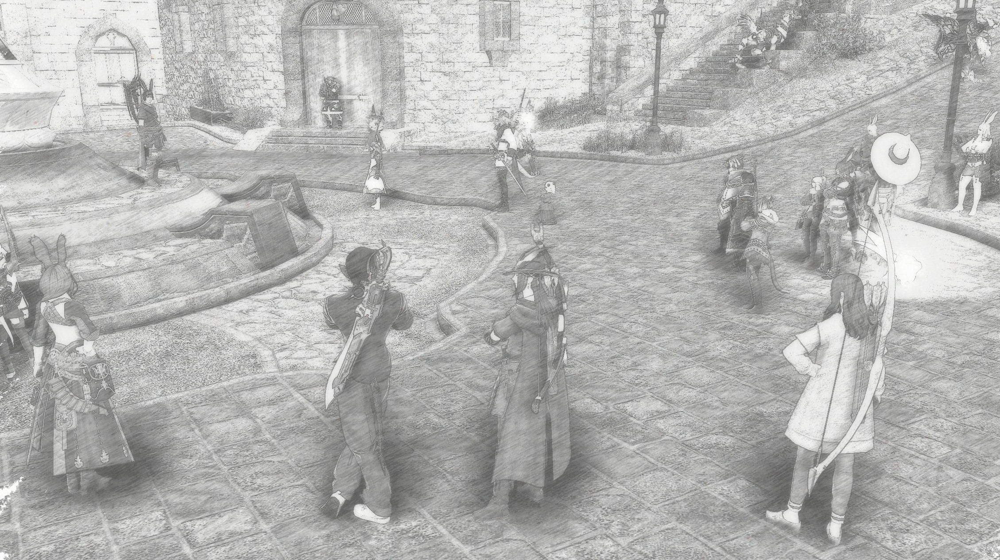
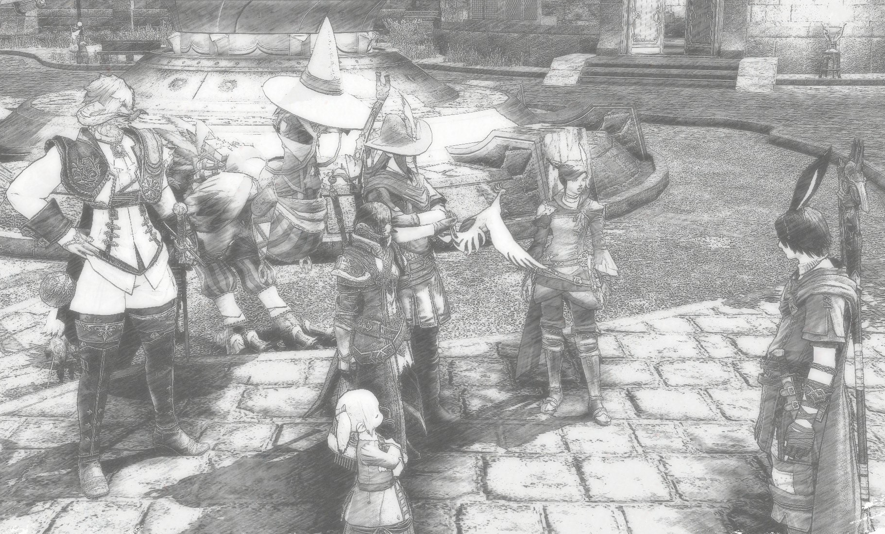

Revenant's Toll, Mor Dhona — Eccentric Viera scholar [Sameyilleur "Sam" Sameen](https://chaosarchives.org/Omega/Sameyilleur_Sameen), previously known for the Learners' Fair gatherings that brought the knowledge of scholars worldwide to the Black Shroud, has announced the Wayfarers' Initiative — a project to pool the resources of adventurers and craftsmen alike, and to help them work together.

Posters advertising the Wayfarers' Initiative had [previously appeared](https://chaosarchives.org/noticeboard/25) on noticeboards all across Eorzea, and I, among many other adventurers, heeded their call, arriving at the Revenant's Toll aetheryte plaza in time for the big speech.

Now, we adventurers are not the kind of people often seen in large crowds — we usually operate in small groups, often with the same comrades in arms, throwing ourselves from one mortal peril to another. And while Revenant's Toll was founded by the Adventurers' Guild, it has somewhat declined in importance since the recent string of victories against the Garlean Empire. So seeing us gathered in one place, one of such symbolic significance to the Guild, is perhaps a sign that this outpost-come-town may soon come to life again, and perhaps become *the* place to go for the most lucrative adventurer leves.

Now, I don't personally know the speaker himself, who only introduced himself as "Sam", but [I was assured](https://chaosarchives.org/Omega/Astree_Givrevent) that he is in fact the brain behind the Learners' Fair. He certainly struck me as passionate, and spoke with vigor; he appealed to the ambition of people coming to Revenant's Toll to research the wilds of Mor Dhona and the fabled Crystal Tower, and for his own lofty ambitions, he talked about setting up a whole network of camps across Eorzea — for travelers, hunters and crafters alike, with the gathering at Revenant's Toll as the first step to a more connected Eorzea where people can expect to find help in the wild, away from major population centers.

With his speech concluded, Sam distributed linkpearls among those willing, for a new linkshell by adventurers for adventurers. One of the linkpearls is now in the possession of yours truly, and rest assured that anything of importance for the wider world that I might learn from Mor Dhona, I will share with our readers posthaste!

<em>Adventurers gather to receive their linkpearls</em>

