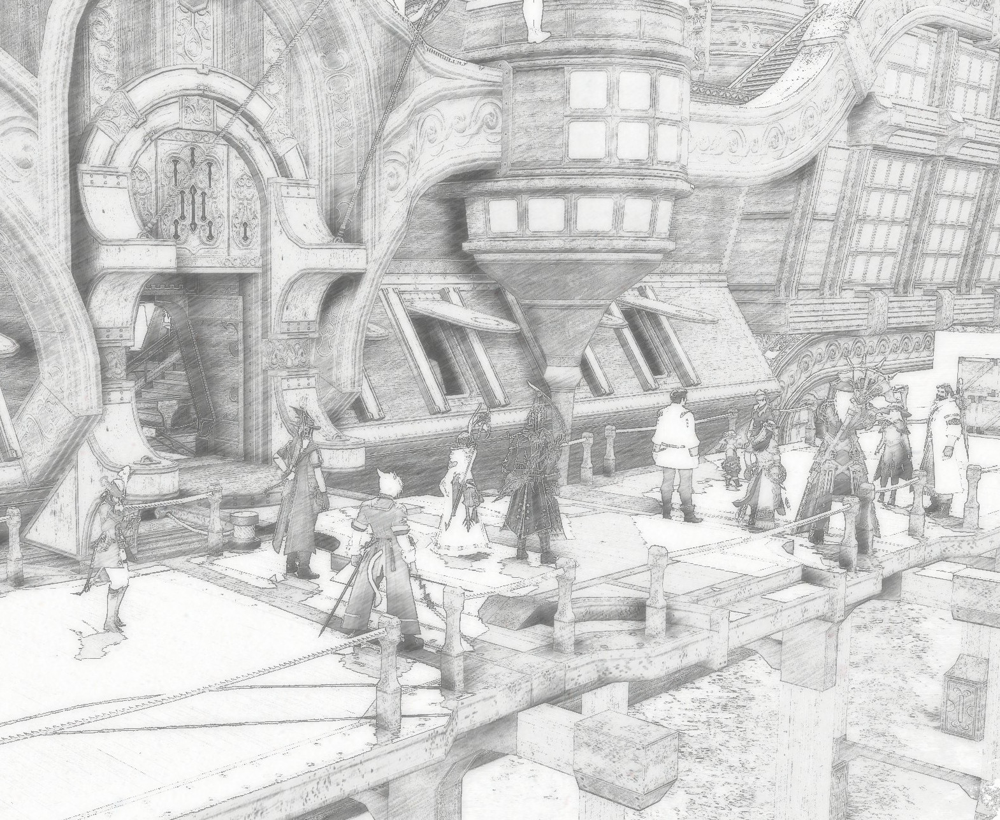

What a hectic start of the week this has been! I thought I would be staying at Revenant's Toll, but the very next morning after the Wayfarers' Initiative gathering, the paper urgently recalled me back to Limsa. And then, fresh off the airship, without even having had the chance to rest from the flight, I took the lift down from the landing zone, only to suddenly find myself in the middle of a very crowded and noisy Drowning Wench.

Now, while Limsa may be a busy port, it's not that usual to suddenly find it visited by what seemed like half of Eorzea. Thankfully, [a friend and comrade in arms of mine](https://chaosarchives.org/Omega/Rhel'sae_Kathir) was able to shed light on this mystery. From what I could gather, there was a call for adventurers and scholars to travel to the Far East, on a massive expedition consisting of several ships.

As for why — I inquired around, turning first to some friends whom I knew from adventures. It quickly turned out that different people had different motivations for going; they saw the flyers and arrived in Limsa for their own reasons, jumping at the call. From what I could tell, there was not a single mastermind I could question about this coming voyage.

I heard rumors, however, that there was some kind of disturbance in the aetherytes of the Far East that either complicated or completely disabled aethernet travel; which is the reason this expedition has to be arranged by conventional sea travel in the first place. This was news to me — but as I do not use aetherytes myself, I can hardly confirm or deny these claims.

And so, in excited buzz, passed what must be the busiest evening the Drowning Wench has seen in the past few months. And now, as I'm writing this, I've made arrangements with the Harborwatch editorship to embark on the voyage as well and cover it as it unfolds. As much it pains me to live my Butterfly Man behind in Eorzea for Twelve know how long, I will of course send him my regards; and you, dear readers, can expect to soon read firsthand accounts of the latest tidings from the Far East — though perhaps delayed if the aetherytes are indeed in disarray!

<em>Passengers boarding the ship to Kugane</em>

